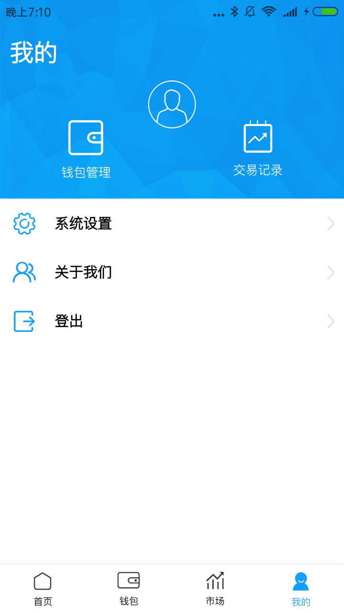
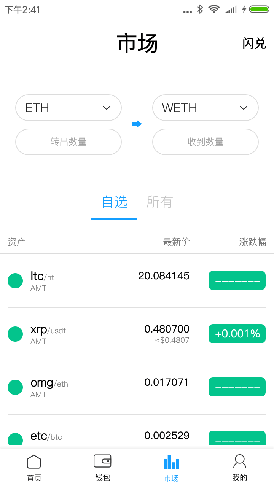
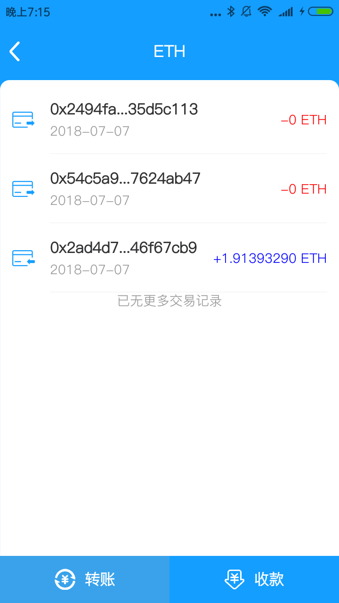
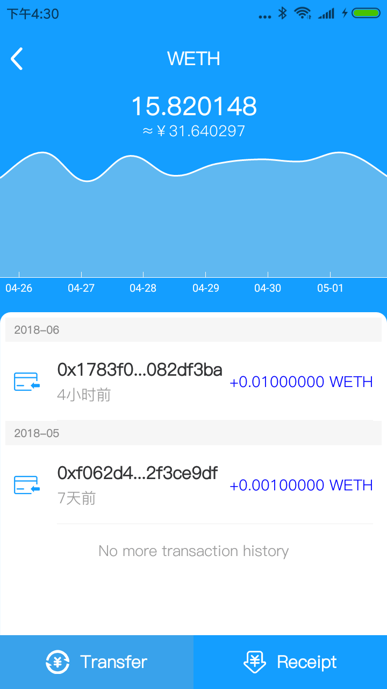
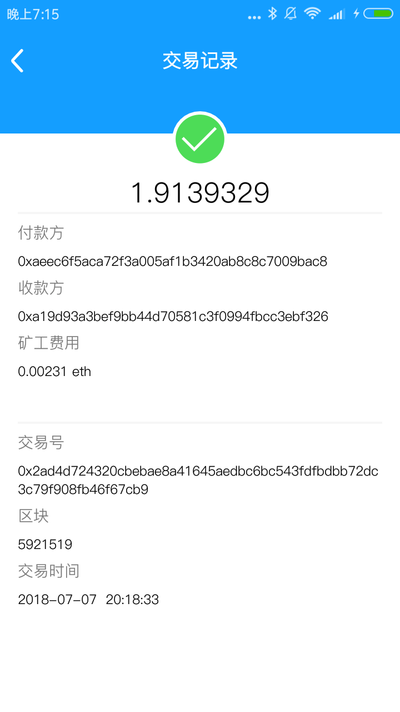
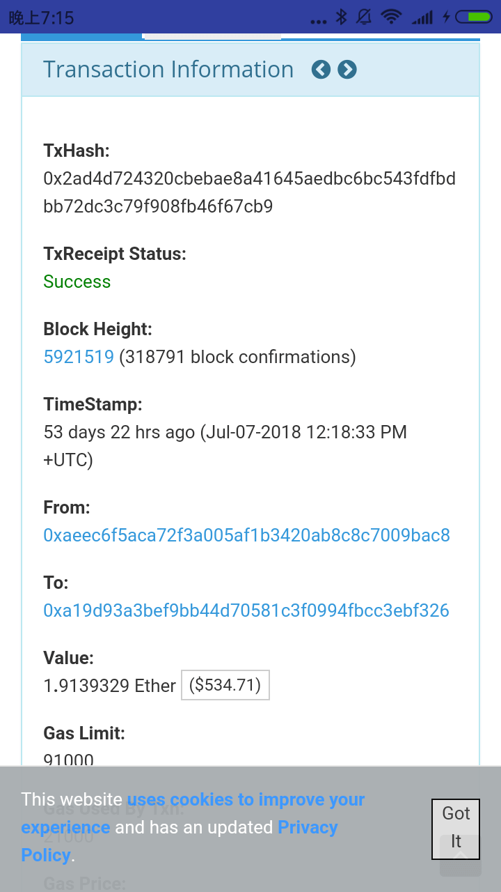
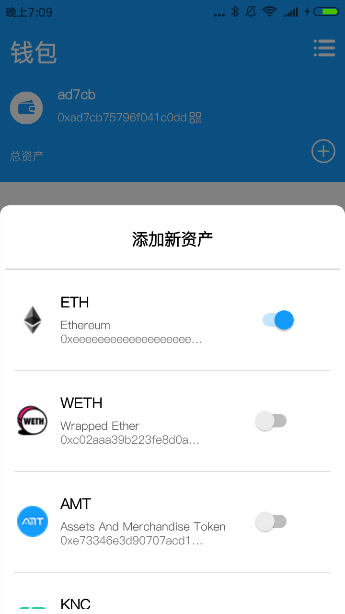
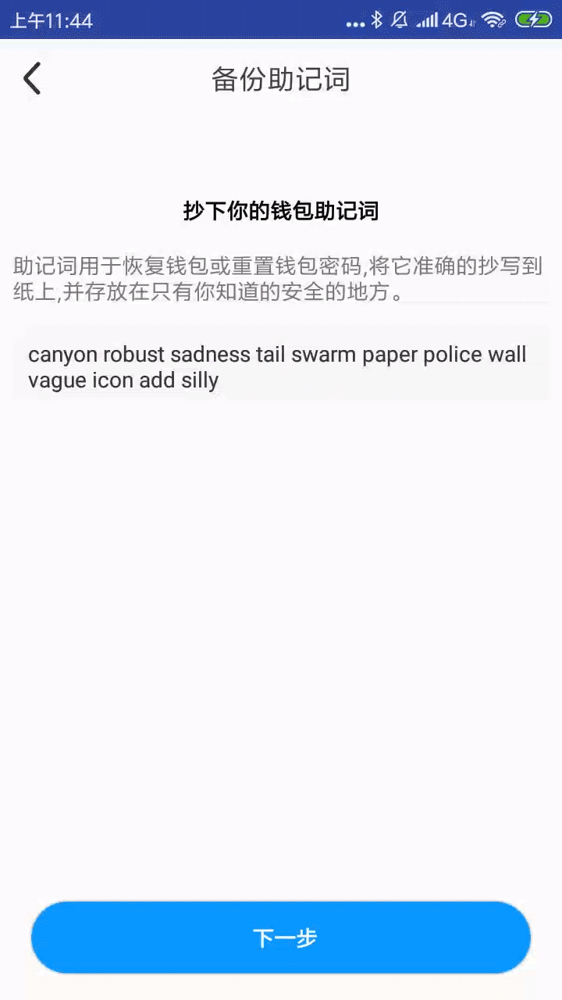

ETHWallet
========

[](https://github.com/hongyangAndroid/FlowLayout)
[](https://github.com/web3j/web3j)
[](https://github.com/bitcoinj/bitcoinj)
目录
====

* [效果演示](#效果演示)
* [说明](#说明)
* [Btc资料](#Btc资料)
* [助记词说明](#助记词说明)
* [ETH钱包](#ETH钱包)

效果演示
==========

部分界面效果
---------
     

         
---------
     

         
---------
     

         
---------
     


     


     


 


说明
====
此项目基于web3j开发的一个android的ETHWallet,其中包含了助记词生成、创建钱包、导入钱包等基础方法。并且包含了btc钱包的生成过程
使用原生web3j生成ECKeyPair的时候 低端机型(华为P6)会闪退，原因是算法复杂度高，CPU使用过高,java运行的速度慢。解决方法把当需要调用web3j 调用SCrypt.scrypt()方法的时候把java算法换成使用JNI C库中的代码

Btc资料
-------
[bitcoin地址是如何生成的](https://www.jianshu.com/p/954e143e97d2)

[获取测试比特币(科学上网)](https://testnet.manu.backend.hamburg/faucet)

[查询测试比特币余额](https://btc.com/)

[地址意义说明](https://learnku.com/articles/5087/bitcoin-test-chain-testnet)

助记词说明
---------
如果想把助记词换成日文、法文、中文等(自己在BIP39，wordlists包创建)，Japanese.INSTANCE 或者 French.INSTANCE
```Java
        // 12个 英文单词
        //随机生成助记词
        StringBuilder sb = new StringBuilder();
        byte[] entropy = new byte[Words.TWELVE.byteLength()];
        new SecureRandom().nextBytes(entropy);
        new MnemonicGenerator(English.INSTANCE).createMnemonic(entropy, sb::append);
        System.out.println(sb.toString());
        String[] parts = sb.toString().split(" ");
```
Btc钱包地址生成过程
====
如果有兴趣 可运行 BtcTest  Module 中的com.alan.btctest.TestBtc
---------
```Java
        BtcWallet btcWallet = new BtcWallet();
        //助记词种子 byte
        byte[] seed = getSeed(mnemonicWordsInAList);

        DeterministicSeed deterministicSeed = new DeterministicSeed(mnemonicWordsInAList, seed, "", 0);

        DeterministicKeyChain deterministicKeyChain = DeterministicKeyChain.builder().seed(deterministicSeed).build();
        //这里运用了BIP44里面提到的算法, 44'是固定的, 后面的一个0'代表的是币种BTC

        //EIP85  提议 以太坊 路径为 :  m/44'/60'/a'/0/n
        //
        //这里 的 a 表示帐号，n 是第 n 生成的地址，60 是在 SLIP44 提案中暂定的，因为 BIP44 只定义到 0 - 31。

        byte[] privKeyBTC = deterministicKeyChain.getKeyByPath(parsePath("M/44/0/0/0/" + n), true).getPrivKeyBytes();

        // 比特币创建的钱包 与连接的网络 有关  如果 选 TestNet   生成的地址一般是以 N \M 开头   MainNet 生成的地址是以 1  \ 3  开头
        ECKey ecKey = ECKey.fromPrivate(privKeyBTC);
        String publickey = Numeric.toHexStringNoPrefixZeroPadded(new BigInteger(ecKey.getPubKey()), 66);
        String privateKey = ecKey.getPrivateKeyEncoded(MainNetParams.get()).toString();
        System.out.println(" ----------------主钱包的 主公私钥 和地址---------------------------");
        System.out.println("主 address:" + ecKey.toAddress(MainNetParams.get()).toBase58());
        System.out.println("测 address:" + ecKey.toAddress(TestNet3Params.get()).toBase58());
        System.out.println(" publickey:" + publickey.length());
        System.out.println(" publickey:" + publickey);
        System.out.println(" privateKey:" + privateKey.length());
        System.out.println(" privateKey:" + privateKey);

        System.out.println("head=" + MainNetParams.get().getAddressHeader());

        System.out.println("-----------------通过公钥获取地址--------------------------");

        String testNetAddress = getAddress(publickey, true, false);

        System.out.println("-----------------Testnet pub key   n/m开头--------------------------");

        String mainNetAddress_Standard_Public = getAddress(publickey, false, false);
        System.out.println("-----------------P2PKH address    1开头--------------------------");
        String mainNetAddress_Multi_Signature = getAddress(publickey, false, true);
        System.out.println("-----------------P2SH address     3开头--------------------------");
```


ETH钱包
===

创建钱包
-------
```Java
        EthWalletManager wManager = new EthWalletManager();
        wManager.createWallet(walletName, password, passwordHit, false, new EthWalletCallBack() {

            @Override
            public void onSuccessCallBack(EthWallet ethWallet, String fileName, String walletAddress, String storeText) throws Exception {

            }

            @Override
            public void onErrorCallBack(Exception e) {

            }
        });
```


导入钱包
-------
```Java
        //三种方法导入
        EthWalletManager wManager = new EthWalletManager();
        ECKeyPair ecKeyPair = wManager.generateECKeyPairByMnemonicWords(mnemonicWordsInAList, password);//助记词导入钱包
        ECKeyPair ecKeyPair = wManager.generateECKeyPairByKeyStore(keystore_content, password) //keystore导入钱包
        ECKeyPair ecKeyPair = wManager.generateECKeyPairByPK(pk_text, password);//私钥导入钱包
        wManager.importWallet(ecKeyPair, walletName, password, passwordHit, mnemonicWords, new EthWalletCallBack() {
            @Override
            public void onSuccessCallBack(EthWallet ethWallet, String fileName, String walletAddress, String storeText) throws Exception {

            }

            @Override
            public void onErrorCallBack(Exception e) {

            }
        });

```


